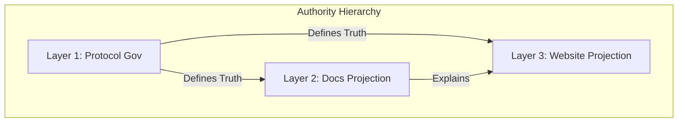

# Governance Constitution

> **Status**: Informative Overview
> **Scope**: Protocol Rules Overview

## 1. The Supreme Authority

The **MPLP Protocol** is governed by the **MPLP Protocol Governance Committee (MPGC)**.
The MPGC ensures the protocol remains:
1.  **Vendor Neutral**: No single entity controls the standard.
2.  **Stable**: Changes require rigorous process (MIP).
3.  **Observable**: All decisions are public and traceable.

## 2. The 3-Layer Governance Model

To prevent scope creep and ensure clarity, governance is divided into three distinct layers.

### Layer 1: Protocol Governance
**"What MPLP IS"**
- **Scope**: L1-L4 Specifications, Schemas, Invariants.
- **Authority**: MPGC (Voting Required).
- **Process**: [MIP Process](/docs/evaluation/governance/protocol-governance).
- **Truth Sources**: [Protocol Truth Index](/docs/evaluation/governance/protocol-truth-index).

### Layer 2: Documentation Projection
**"How MPLP is EXPLAINED"**
- **Scope**: Documentation Content (`docs/`).
- **Authority**: Documentation Maintainers.
- **Process**: [Documentation Projection Governance](/docs/evaluation/governance/documentation-projection).
- **Constraint**: Aligns with Layer 1 Truth.

### Layer 3: Website Governance (Projection)
**"How MPLP is PRESENTED"**
- **Scope**: Marketing, Discovery, SEO.
- **Authority**: Website Maintainers.
- **Process**: Website Truth Policy (See `website-governance/README.md` in repo root).
- **Constraint**: Read-Only Projection of Layer 1 & 2.

## 3. Governance Documents

| Document | Purpose |
|:---|:---|
| [MIP Process](/docs/evaluation/governance/protocol-governance) | How to propose protocol changes |
| [Contributing Guide](/docs/evaluation/governance/contributing) | How to contribute to MPLP |
| [Security Policy](/docs/evaluation/governance/security-policy) | Reporting vulnerabilities |
| [Versioning Policy](/docs/evaluation/governance/versioning-policy) | Semantic versioning rules |
| [Compatibility Matrix](/docs/evaluation/governance/compatibility-matrix) | Version compatibility |
| [License Governance](/docs/evaluation/governance/license-governance) | Apache-2.0 licensing |
| [External Trust Overview](/docs/evaluation/governance/EXTERNAL_TRUST_OVERVIEW) | Trust model & forbidden claims |
| [Protocol Truth Index](/docs/evaluation/governance/protocol-truth-index) | Authoritative truth sources |

## 4. Release & Change History

All protocol releases, freeze declarations, and change logs are maintained in:

→ [Release History](/docs/meta/release/mplp-v1.0.0-release-notes)

## 5. External Trust

MPLP is designed for **Zero-Trust** environments.
See [External Trust Overview](/docs/evaluation/governance/EXTERNAL_TRUST_OVERVIEW) for the threat model and trust boundaries.
