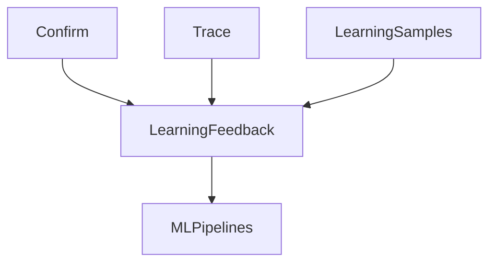

> [!IMPORTANT]
> **Non-Normative Document**
>
> This document is informative only.

# Learning Feedback — Conceptual Overview

> **Status**: Informative (Non-Normative)
> **Audience**: Implementers, ML Engineers
> **Authority**: Documentation Governance
> **Governance Rule**: DGP-30

## 1. What Learning Feedback Refers To

**Learning Feedback** in MPLP refers to the **improvement dimension** that concerns how agent experiences are captured for reinforcement learning and fine-tuning.

Learning Feedback is **not a training pipeline**. It is a **conceptual area** for structured experience capture.

## 2. Conceptual Areas Covered by Learning Feedback

| Conceptual Area | Description |
|:---|:---|
| **Learning Samples** | Relates to structured experience records |
| **User Feedback** | Concerns approval/rejection signals from Confirm |
| **Intent Resolution** | Is involved in intent-to-plan mapping samples |
| **Delta Impact** | Relates to change prediction samples |

## 3. What Learning Feedback Does NOT Do

- ❌ Define training algorithms
- ❌ Mandate specific ML frameworks
- ❌ Prescribe model architectures
- ❌ Define reward functions

## 4. Where Normative Semantics Are Defined

| Normative Source | What It Covers |
|:---|:---|
| **Learning Schemas** (`learning/*.schema.json`) | Sample structures |
| **Learning Invariants** | 12 rules for sample structure |
| **Confirm Module** | User feedback capture |

## 5. Conceptual Relationships

## 6. Reading Path

1. **[Learning Overview](../../../guides/examples/learning-notes/learning-overview.md)**
> **Note**: The Learning Sample Specification is currently under revision.

---

**Document Status**: Informative (Non-Normative)
**Governance Rule**: DGP-30
**See Also**: [Learning Feedback Anchor](learning-feedback.md) (Normative)
