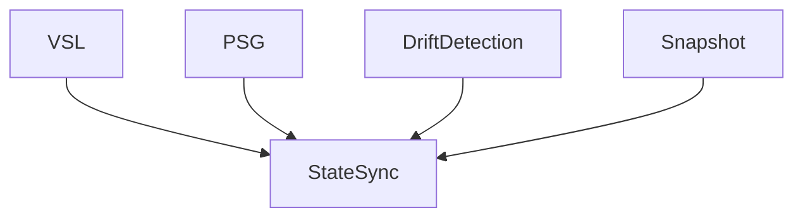

> [!IMPORTANT]
> **Non-Normative Document**
>
> This document is informative only.

# State Sync — Conceptual Overview

> **Status**: Informative (Non-Normative)
> **Audience**: Implementers, Architects, Runtime Authors
> **Authority**: Documentation Governance
> **Governance Rule**: DGP-30

## 1. What State Sync Refers To

**State Sync** in MPLP refers to the **consistency dimension** that concerns how PSG (Project Semantic Graph) state remains coherent across operations. It spans VSL, PSG snapshots, and drift detection.

State Sync is **not a synchronization service**. It is a **conceptual area** describing state coherence responsibilities.

## 2. Conceptual Areas Covered by State Sync

| Conceptual Area | Description |
|:---|:---|
| **PSG Integrity** | Relates to referential integrity across graph nodes |
| **Snapshot/Restore** | Concerns point-in-time state capture semantics |
| **Drift Detection** | Is involved in reconciling PSG vs. external state |
| **VSL Abstraction** | Relates to state persistence interfaces |

## 3. What State Sync Does NOT Do

- ❌ Define specific database technologies
- ❌ Mandate distributed consensus protocols
- ❌ Prescribe conflict resolution strategies
- ❌ Define replication topologies

## 4. Where Normative Semantics Are Defined

| Normative Source | What It Covers |
|:---|:---|
| **L3 Execution & Orchestration** | PSG management, VSL interface, drift detection |
| **L1-L4 Architecture Deep Dive** | Snapshot/restore, atomic transactions |

## 5. Conceptual Relationships

## 6. Reading Path

1. **[L3 Execution & Orchestration](../l3-execution-orchestration.md)** — PSG, VSL, drift
2. **[L1-L4 Architecture Deep Dive](../l1-l4-architecture-deep-dive.md)** — Advanced state management

---

**Document Status**: Informative (Non-Normative)
**Governance Rule**: DGP-30
**See Also**: [State Sync Anchor](state-sync.md) (Normative)
